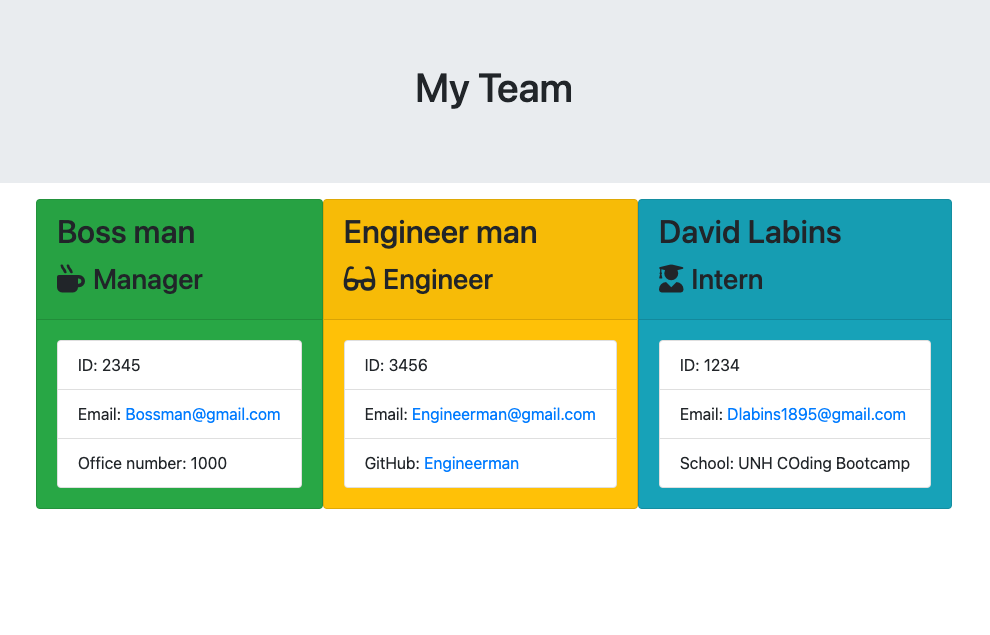
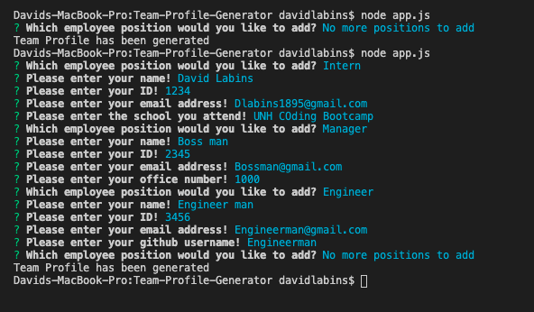

# Team-Profile-Generator
The purpose of this application is to generate a profile for each position within a company with options of intern, engineer, or manager all through a command line. Technologies used in this application include node, javascript, and html. 
The inspiration for this project is the following:
As a manager
I want to generate a webpage that displays my team's basic info
so that I have quick access to emails and GitHub profiles.

This project can be found on github at https://github.com/Dlabins/Team-Profile-Generator then viewed on a webpage after completeing the command line prompts once "node app.js" is entered into the terminal!

